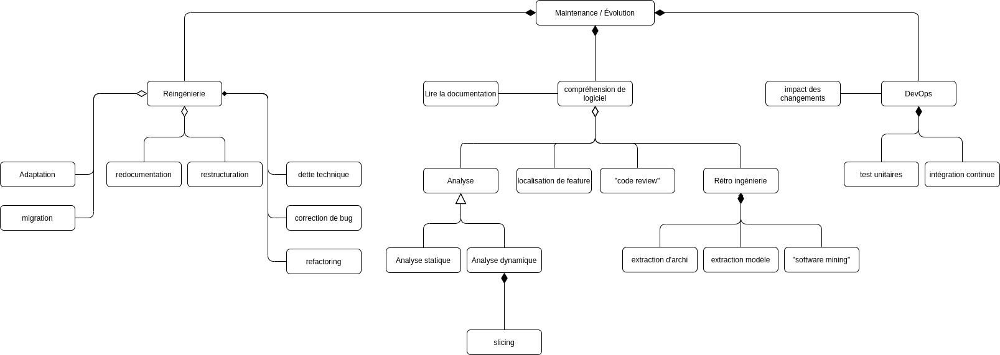

# HAI913I - TD1

## Exercice 1

👉 Finir l'UML sur [diagram.net](https://app.diagrams.net/#G1QzbtbdfJ8PRbNUPeOOFBPwtm-ggDqrqp)

## Exercice 2

👉 Reverse Engeenering

Ceci peut être réalisé en utilisant des outils d'analyse comme le désassembleur ou le décompilateur. On essaie de reconstituer un modèle de données à partir des structures physiques des fichiers ou des tables.

👉 Reengeenering

Il faut décortiquer notre application actuel pour en comprendre son fonctionnement (soit par la documentation soit par Rétro-ingénierie), par la suite on peut établir un plan d'action, notamment en déterminant les potentielles évolution (mise à niveau, résolution de bug) de l'application ou même la conception de l'application sous un format mobile. Une fois les coût identifiés et la méthodologie obtenus on peut commencer à implémenter.

👉 Qualité et refactoring 

Pour évaluer la qualité de la précédente application on peut effectuer un benchmark avec notre application actuelle. Par exemple on peut utiliser la méthode suivante [PerfDiff](https://www.semanticscholar.org/paper/Analyzing-Performance-Differences-between-Multiple-Kalbarczyk-Imam/6a01c55c2c296ba798a027ed292cc65245f84320)

Pour pouvoir estimer la qualité d'une application on peut utiliser les métriques suivantes:
- Performance
- Design
- Sécurité
- Fiabilité
- Documentation

Amélioration ...

👉 Compréhension

👉 Localisation des features et traçabilité

## Exercice 3

🚩 SonarQube

👉 Quoi ? Logiciel open source permettant de nettoyer, optimiser et réparer un code afin de le rendre le plus propre possible en alertant aussitôt les développeurs pour prendre les mesures nécessaires.

👉 Pourquoi ? Très utile pour obtenir une application finale stable et faciliter la vie des dev notamment pour la maintenabilité du logiciel. Elle permet aux équipes de développement de perdre moins de temps à chercher et corriger les erreurs, rendant le processus plus efficaceeee donc moins coûteux.

👉 Qui ? Toute équipe de dev. logiciel notamment pour ceux adoptant une approche Agile et DevOps

*Source:* [syloe.com](https://www.syloe.com/)

🚩 CheckStyle

👉 Quoi ? Outil de dev. pour faciliter les programmeurs à écrire du code Java qui respecte une norme de codage. Il automatise le processus de vérification du code Java la tâche au dev. Il est donc idéal pour les projets qui veulent faire respecter une norme de codage. Simple et rapide d'utilisation il s'installe comme un plugin sur son éditeur de texte.

👉 Pourquoi ? Car c'est trop bien d'avoir un code clean. blablater quoi.

👉 Qui ? Toute équipe de dev.

## Exercice 4

🚩 Refactoring Asynchrony in JavaScript

👉 Refactorisation des fonctions de callback en promise de façon automatisée (PROMISESLAND).

👉 Ils démontrent les problèmes liés au callback notamment les callback imbriqués, gestion des erreurs (error-first protocol)

👉 Une promise est un **design pattern** qui gère les événements asynchrones et résout bon nombre des problèmes liés aux callback.
