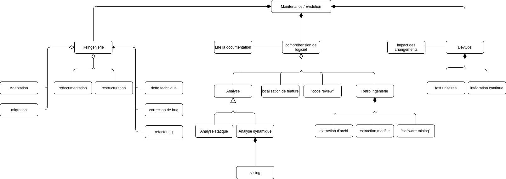

# HAI913I - TD1

## Exercice 1

👉 Finir l'UML sur [diagram.net](https://app.diagrams.net/#G1QzbtbdfJ8PRbNUPeOOFBPwtm-ggDqrqp)

## Exercice 2

👉 Reverse Engeenering

En utilisant des outils d'analyses tels qu'un désassembleur ou un décompileur nous pouvons retrouver les patrons de conceptions d'un programme et ainsi reformer le diagramme UML associé à notre application. Cette méthode ne peut pas être totalement automatisée car le code assembleur créé est souvent imparfait et nécessite l’intervention d’un développeur pour améliorer ou corriger le code. Côté base de données, il est possible de reconstituer des modèles de données en utilisant des structures physiques comme des fichiers ou tables.

👉 Reengeenering

Il faut décortiquer notre application actuelle pour en comprendre son fonctionnement (soit par la documentation ou encore par rétro-ingénierie), par la suite on peut établir un plan d'action, notamment en déterminant les potentielles évolutions (mises à niveau, nouvelles fonctionnalités...) ou même la conception de l'application au format mobile (UML, méthode et logiciel de développement, adaptation à la nouvelle plateforme...). Une fois les coûts et la méthodologie obtenus on peut commencer à migrer notre application.

👉 Qualité et refactoring 

Pour évaluer la qualité de la précédente application on peut effectuer un benchmark avec notre application actuelle. Par exemple on peut utiliser des méthodes automatisées comme [PerfDiff](http://web.cs.ucla.edu/~tianyi.zhang/perfdiff.pdf) ou encore [Google Lighthouse](https://developers.google.com/web/tools/lighthouse) pour les sites webs. Autrement, il est possible de comparer point par point chaque élément cité ci-dessous et juger les points qui ont évolué ou au contraire régressé.

Pour pouvoir estimer la qualité d'une application on peut utiliser les métriques suivantes:
- Performance
- Sécurité
- Fiabilité
- Documentation
- Maintenabilité
- Taille

On peut améliorer notre application en corrigeant les problèmes des points cités précédemment, mais pour ce faire notre application devras parfois se refaire une beauté et migrer vers une nouvelle technologie, souvent plus moderne et plus efficace.

👉 Compréhension

Pour une meilleur compréhension du programme il faut se renseigner auprès de la documentation si disponible. Sinon une analyse dynamique du programme s'avérer être nécessaire, accompagné d'une analyse statique et d'un "code review".

👉 Localisation des features et traçabilité

Il est possible de localiser le code associé à une feature à l'aide des "pull request" présente sur git, si celui-ci est bien formé, sinon il faut opter pour de la compréhension de logiciel.

## Exercice 3

🚩 SonarQube

👉 Quoi ? Logiciel open source permettant de nettoyer, optimiser et réparer un code afin de le rendre le plus propre possible en alertant aussitôt les développeurs pour prendre les mesures nécessaires.

👉 Pourquoi ? Très utile pour obtenir une application finale stable et faciliter la vie des dev notamment pour la maintenabilité du logiciel. Elle permet aux équipes de développement de perdre moins de temps à chercher et corriger les erreurs, rendant le processus plus efficaceeee donc moins coûteux.

👉 Qui ? Toute équipe de dev. logiciel notamment pour ceux adoptant une approche Agile et DevOps

*Source:* [syloe.com](https://www.syloe.com/)

🚩 CheckStyle

👉 Quoi ? Outil de dev. pour faciliter les programmeurs à écrire du code Java qui respecte une norme de codage. Il automatise le processus de vérification du code Java la tâche au dev. Il est donc idéal pour les projets qui veulent faire respecter une norme de codage. Simple et rapide d'utilisation il s'installe comme un plugin sur son éditeur de texte.

👉 Pourquoi ? Car c'est trop bien d'avoir un code clean. blablater quoi.

👉 Qui ? Toute équipe de dev.

## Exercice 4

🚩 Refactoring Asynchrony in JavaScript

👉 Refactorisation des fonctions de callback en promise de façon automatisée (PROMISESLAND).

👉 Ils démontrent les problèmes liés au callback notamment les callback imbriqués, gestion des erreurs (error-first protocol)

👉 Une promise est un **design pattern** qui gère les événements asynchrones et résout bon nombre des problèmes liés aux callback.
