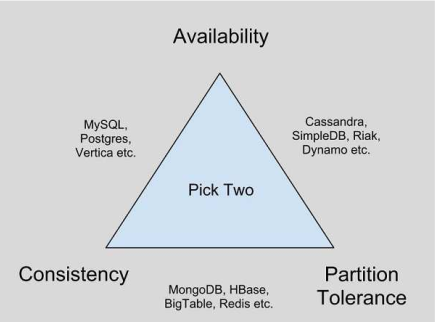

# HAI914I - Gestion des données au delà de SQL (NoSQL)

## Liens

🔗 [Moodle](https://moodle.umontpellier.fr/course/view.php?id=22507)

## Préambule

### Quand passer au NoSQL ?

* évolution fréquent de schémas
  * entités ayant diverses carac. souvent non renseignées
  * nombreuses associations [1..*] aux extrémités
* lecture/écriture très élevé
* données distribuées

`Persistance Polyglotte`: exprime l'idée que les applications informatiques devraient être écrites dans un mélange de différents langages de programmation, afin de tirer parti du fait que différents langages conviennent à la résolution de différents problèmes. Ce même concept peut s'appliquer aux bases de données : une application peut communiquer avec différentes bases de données, en utilisant chacune d'entre elles pour ce qu'elle sait faire de mieux afin d'atteindre un objectif final, d'où le terme de persistance polyglotte.

`Scalabilité`: La scalabilité d'une base de donnée est sa capacité à s'étendre sur plusieurs serveurs au lieu d'être limitée à un seul. Ainsi, il est théoriquement possible, d'augmenter à l'infini, les capacités de stockage et de traitement de la base en rajoutant des serveurs. De cette façon, les capacités de l'outil augmentent proportionnellement au nombre d'utilisateurs et à la quantité de données à traiter.

`Réplication` est essentiellement destinée à pallier les pannes en dupliquant une collection sur plusieurs serveurs et en permettant donc qu’un serveur prenne la relève quand un autre vient à faillir.

`Partitionnement` c'est de la fragmentation concrètement.

### Grands principes du NoSQL

* Simplicité
* Flexibilité
* Efficacité
* Passage à l'échelle
  * partitionnement dynamique
  * réplication à large échelle
  * architecture décentralisée

### Principe CAP

👉 Constat de Brewer: aucun système distribué ne peut satisfaire en même temps les principes C, A et P (au mieux 2 sur les 3)

* `Consistency` (cohérence) : toute modification de donnée est suivie d'effet pour tous les nœuds du système.
* `Availability` (disponibilité): toute requête émise et traitée par un nœud du système, reçoit une réponse (même en situation d'échec à produire une réponse)
* `Partition tolerance` (recouvrement des nœuds): assurer une continuité du fonctionnement en cas d'ajout/suppression de nœuds du système

### Typologie

* Principe de base
  * Système clé/valeur &rarr; aucune complexité  
  * Système orienté colonne &rarr; complexe  
  * Système orienté document &rarr; complexité dans le document.
* Système orienté graphe

## Cypher & Neo4J

👉 Schema-less ([voir diapo 36](cours/cours1.pdf))

👉 Clauses principale & exemple Cypher ([voir diapo 41 à 57](cours/cours1.pdf)).