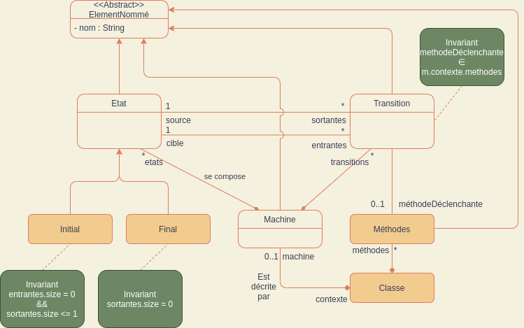
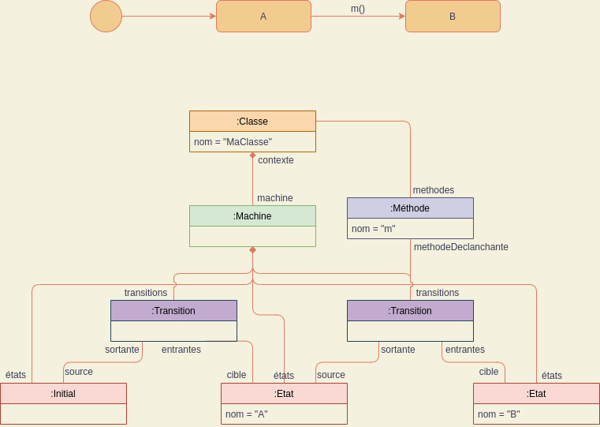
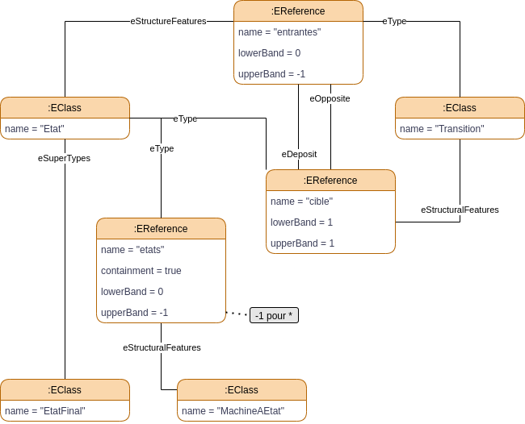

# HAI919I - TD1

## Question 1

👉 Métamodèle de machine à états représenté avec une syntaxe de diagramme de classes UML

## Question 2 & 4

👉 Un modèle de machine à états représenté avec la syntaxe des machines à états et en diagramme de classes UML.

## Question 3

👉 Notre métamodèle sous forme d'instance d'Ecore

