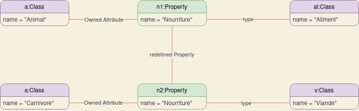

# HAI919 - TP2 | Sujet 2

- [HAI919 - TP2 | Sujet 2](#hai919---tp2--sujet-2)
  - [Exercice 1 | Multiplicités](#exercice-1--multiplicités)
    - [Question 1.1](#question-11)
  - [Exercice 2 | Découverte du métamodèle](#exercice-2--découverte-du-métamodèle)
  - [Correction](#correction)

## Exercice 1 | Multiplicités

### Question 1.1

Au lieu de citer les multiplicités valides, je vais citer les invalides, car moins nombreuses et plus facile pour la compréhension.

👉 Les multiplicités qui semblent invalides:
- Une biblitothèque propose [-1..*] ouvrage, -1 n'est pas admis car non positif. 
- Un exemplaire est emprunté par [2..1] abonné
- Un abonné adhère à * bibliothèques, si il est abonné alors il appartient forcément à 1 ou * bibliothèques.
- Pile contient *getTaille()* (resp. *depiler()*) element, n'est pas valide car *getTaille()* (resp. *depiler()*) n'est pas constant.

## Exercice 2 | Découverte du métamodèle

## Correction

Une correction sera disponible sur moodle